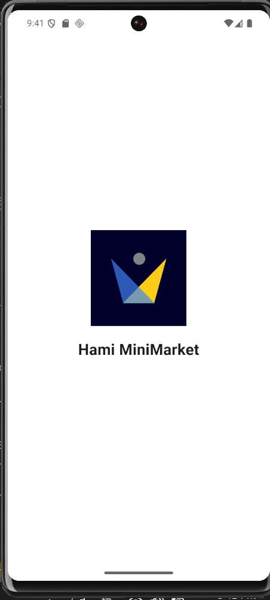
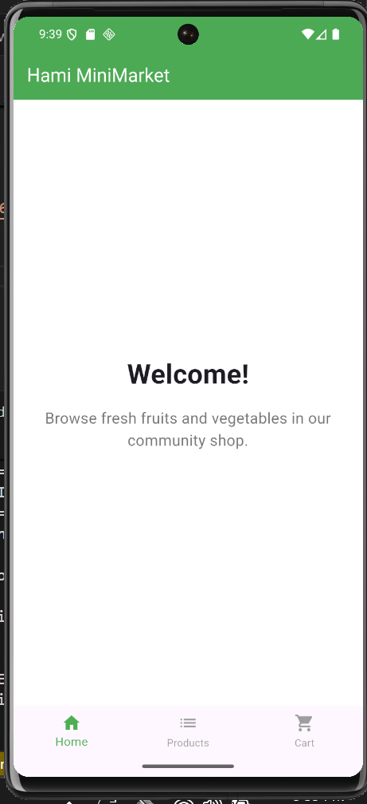
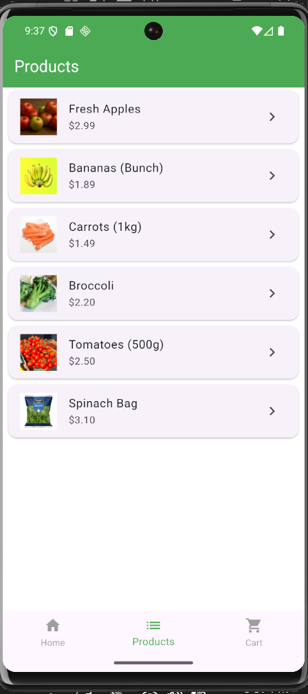
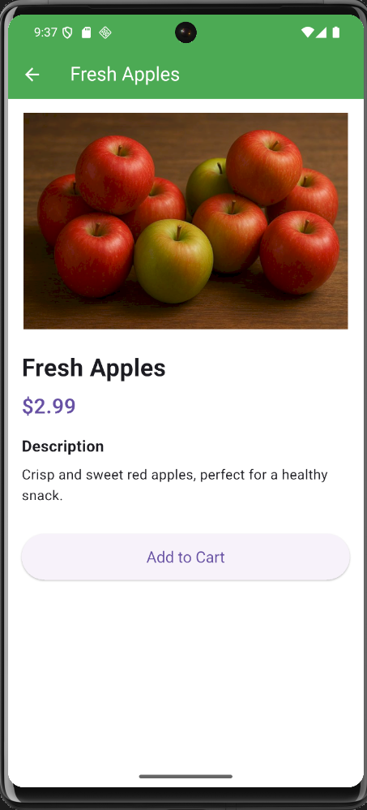
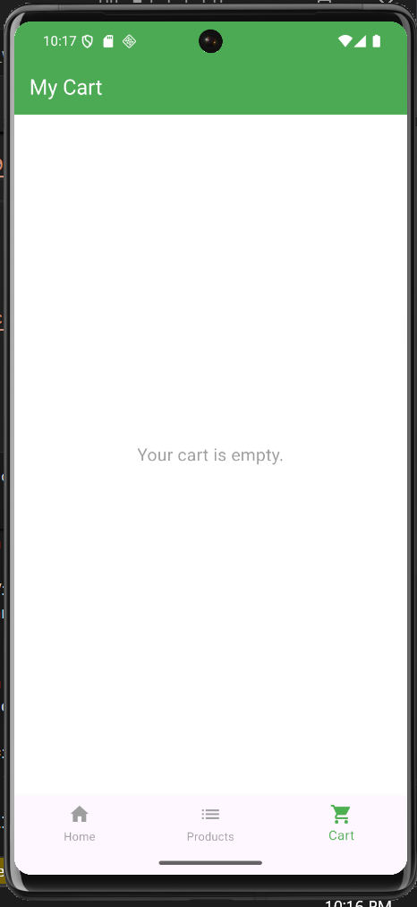
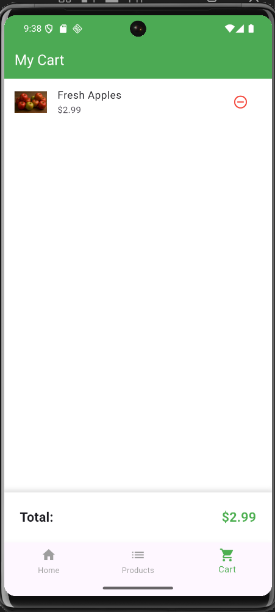

# Hami MiniMarket - Flutter Prototype

> This project is the Week 1 submission for the HamiSkills Internship - Flutter Development Track.

Hami MiniMarket is a mobile app prototype for a community shop specializing in fresh fruits and vegetables.This application serves as a demonstration of Flutter fundamentals, including UI/UX design with widgets, screen navigation, and basic state management.

## ✨ Features

📱 **Splash Screen:** App loading screen with the Hami MiniMarket logo.
🏠 **Home Screen:** A welcoming landing page with a welcome message.
🍎 **Product List:** Displays all available fruits and vegetables with their name, price, and image.
ℹ️ **Product Details:** A detailed view for each product, showing a description and an "Add to Cart" button.
🛒 **Shopping Cart:** A functional cart that lists selected items and calculates the total price.
🧭 **Bottom Navigation:** (Bonus) Easy navigation between Home, Products, and Cart screens.
⚙️ **State Management:** (Bonus) Uses `setState` to dynamically update the cart in real-time.

## 📸 Screenshots

| Splash | Home | Products |
| :---: | :---: | :---: |
|  |  |  |
| **Details** | **Cart (Empty)** | **Cart (Full)** |
|  |  |  |

## 💻 Tech Stack

**Framework:** Flutter 
**Language:** Dart
**State Management:** `setState` 
**Navigation:** `Navigator.push` & `Navigator.pop` 
**Data:** Hardcoded dummy data (list of products) 

## 🚀 How to Run Locally

Follow these instructions to get a copy of the project running on your local machine.

1.  **Clone the repository:**
    ```bash
    git clone [https://github.com/Sharmasheeno/hamiskills-internship-flutter-project.git](https://github.com/Sharmasheeno/hamiskills-internship-flutter-project.git)
    ```

2.  **Navigate to the project directory:**
    ```bash
    cd hamiskills-internship-flutter-project
    ```

3.  **Install dependencies:**
    ```bash
    flutter pub get
    ```

4.  **Run the app:**
    (Ensure you have an emulator running or a device connected)
    ```bash
    flutter run
    ```

## 👤 Author

* **GitHub:** [@Sharmasheeno](https://github.com/Sharmasheeno)
